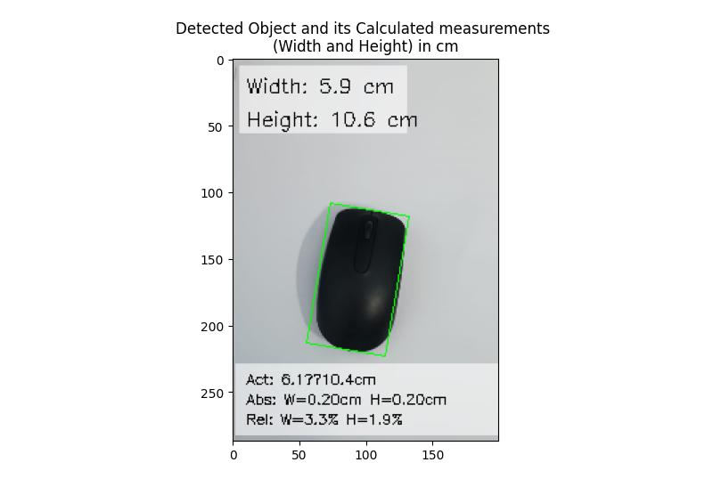
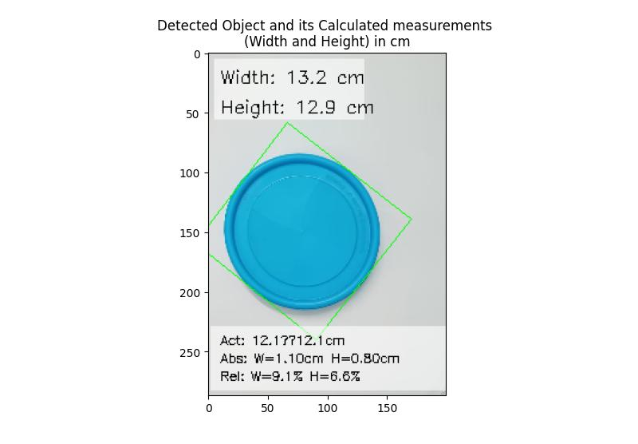
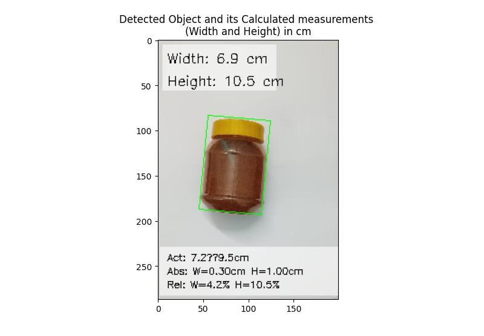

# Snap-Measure

[](https://www.python.org/downloads/)
[](https://opencv.org/)

A computer vision system for measuring object dimensions using OpenCV without requiring deep learning models.

## 🎯 Project Overview

Snap-Measure accurately calculates the physical dimensions (width and height) of objects using computer vision techniques. The system supports multiple measurement methods:

1. **A4 Paper Reference**: Place objects on an A4 paper (210 x 297 mm) for automatic calibration
2. **Custom Reference Objects**: Use any object of known dimensions as a reference
3. **Camera Calibration**: Apply camera calibration for more accurate measurements

### Key Features

- Measure object dimensions in centimeters with good accuracy
- Works with still images (pre-captured or taken through webcam)
- Multiple measurement approaches (A4 paper, custom reference object, camera calibration)
- Error metrics calculation when actual dimensions are provided
- Uses purely OpenCV-based computer vision techniques
- Visualizes results with bounding boxes and dimension labels

## 🔧 Installation

1. Clone the repository:
   ```bash
   git clone https://github.com/viveksapkal2793/Snap-Measure.git
   cd Snap-Measure
   ```

2. Install the required dependencies:
   ```bash
   pip install opencv-python numpy matplotlib imutils
   ```

## 🚀 Usage

### Using the Image Pipeline

Run the main pipeline script to analyze an image:

```python
from src.pipeline_for_still_images import pipeline_for_still_images

# Using a pre-captured image with A4 paper method
output_img = pipeline_for_still_images(
    prompt_user=False,
    image_path="input_images/mouse.jpg",
    visualize=True
)

# Using a custom reference object
output_img = pipeline_for_still_images(
    prompt_user=False,
    image_path="input_images/credit_card.jpg",
    use_reference_object=True,
    reference_object_dimensions=(8.56, 5.4),  # Credit card dimensions in cm
    visualize=True
)
```

### Command Line Usage

```bash
# Basic usage with A4 paper method
cd src
python pipeline_for_still_images.py

# Using custom reference object (e.g., credit card)
python pipeline_for_still_images.py --use_reference_object --reference_width=8.56 --reference_height=5.4 --image_path="../input_images/credit_card.jpg"
```

## 📋 How It Works

### A4 Paper Method
1. **Image Acquisition**: Load a saved image or capture one using a webcam
2. **Preprocessing**: Convert to grayscale, apply thresholding and morphological operations
3. **Reference Object Detection**: Detect the A4 paper in the image
4. **Perspective Transformation**: Transform the view to get a top-down perspective of the paper
5. **Object Detection**: Locate the object of interest on the paper
6. **Dimension Calculation**: Measure the object's dimensions using the known A4 paper size
7. **Visualization**: Display the results with dimension annotations

### Custom Reference Object Method
1. **Image Acquisition**: Load a saved image with both reference object and target object
2. **Preprocessing**: Apply image preprocessing techniques
3. **Reference Detection**: Detect the reference object of known dimensions
4. **Pixels-per-Unit Calculation**: Calculate the pixels-to-centimeters ratio
5. **Object Detection**: Detect the object to be measured
6. **Dimension Calculation**: Calculate dimensions based on the reference object
7. **Visualization**: Display results with annotations

## 📊 Sample Results

Here are some example outputs from Snap-Measure:


*Measuring a computer mouse using the A4 paper method*


*Measuring a lid using the A4 paper method*


*Measuring a jar using the A4 paper method*

## ⚠️ Important Notes

For best results:

- **Avoid white objects** on the white A4 paper (poor contrast causes detection issues)
- Place **only one object** on the paper at a time
- Capture images in **good lighting conditions** (not too bright, not too dark)
- Ensure the **entire reference object** fits within the frame
- Use a **clean background** for better detection
- When using the reference object method, ensure the reference and target objects are on the same plane

## 🔮 Future Improvements

1. **Real-time Detection**: Enable continuous measurement from video feed
2. **Multiple Object Support**: Detect and measure several objects simultaneously
3. **Machine Learning Integration**: Add optional ML models for better object detection
4. **Mobile App**: Develop a mobile application for on-the-go measurements
5. **Graphical User Interface**: Develop a user-friendly GUI
6. **3D Measurements**: Extend to support volume and depth measurements

## 🤝 Contributing

Contributions are welcome! Please feel free to submit a Pull Request.

## 📬 Contact

For questions or feedback, please open an issue in the GitHub repository.