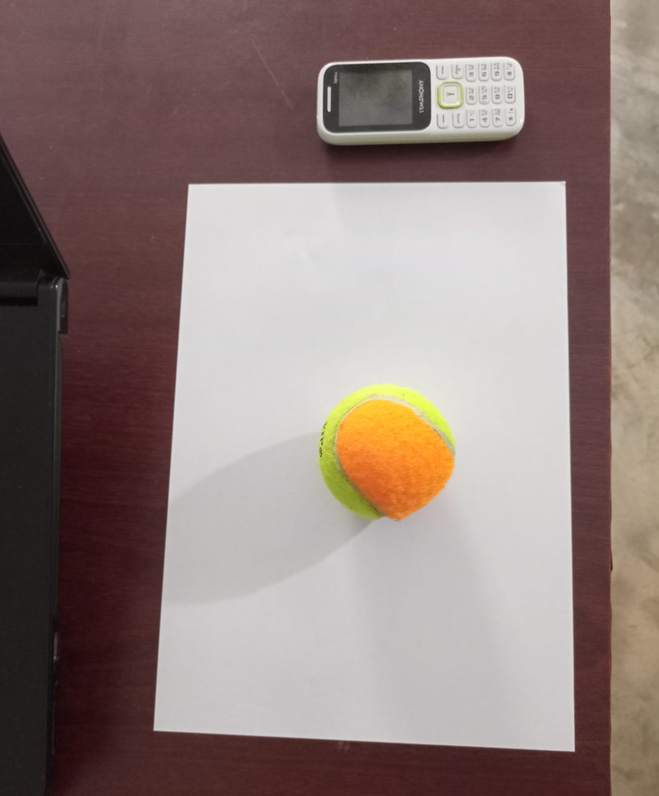
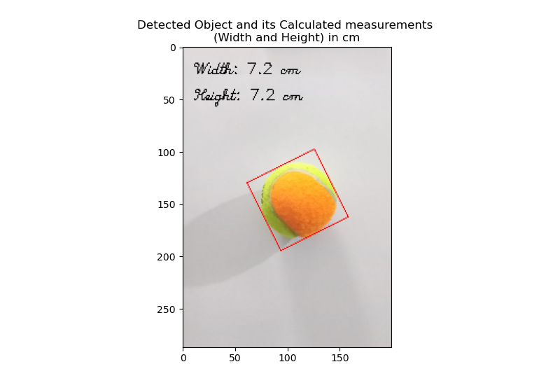

<!-- --------------------------------------------------
# VisionMeasure: Object Dimension Measurement with OpenCV
----------------------------------------------

----------------------------------------
## Project Goal

The goal is to develop a system using OpenCV that can be used to reliably measure the dimension of various types of objects in real time using the presence of a known object (an object whose dimension is known) in the frame. 

-----------------------------------------------

## Current Status, Usage, and Project Description

The object to measure should be placed on an A4 paper whose dimensions are known (210 x 297 mm). 

### Caution !!!

Before you proceed to use this application please note the following -- 
    1. Since the A4 paper is white, placing white objects on the paper will 
    most likely produce a faulty outcome.
    2. Place only one object on the A4 paper at a time. To reduce false detection, only the highest 
    perimeter object is filtered from all the possible detections.
    3. This application only uses OpenCV and no deep learning model. So, due 
    to the constraints of classical computer vision, the results may not be 
    100% accurate. Long story short, Use at your own risk.

To improve the chance of correct recognition and measurement you can do the following --
    1. Capture the image on a clean background.
    2. Try to fit the whole A4 paper inside the frame.
    3. Lighting conditions should not be too dark or too bright.

### Usage

The current implementation has a Python script named `pipeline_for_still_images.py`. 

Run this script for detecting objects of interest from a still image and finding the objects' dimensions (width, height) in cm.

    Object of interest - Largest perimeter object placed on top of the A4 paper.

**Args**:
    
    prompt_user: whether to prompt the user for image path or, device id. (default: False)
    
    image_path: to use a stock/pre-captured image instead of prompting the user. (default: "./sample_imgs/paint_brush.jpeg")
    
    capturing_device_id: to capture a live image instead of prompting or loading a stock one. (default: None)
    
    visualize: whether to show the output image containing the info of detections. (default: True)
    
    scale: matplotlib_imshow() function visualization scale. (default: 8)

**Returns**: The output image (a rotated bounding box is drawn around the object of interest. The calculated dimensions (width, height) are also shown on the output image).

#### Demo of using the application

- Image used


- Running the script


- Result


-------------------------------------------------

## Future Prospect

1. **Real-time detection**: measurement from live capture (currently I don't have a USB Webcam so can't implement it right now).
2. **Dimension Verification**: a validation step can be introduced to ensure the accuracy of the measured dimensions. This could involve comparing the measured dimensions to ground-truth values or using multiple reference objects for calibration.
3. **Custom reference object**: Use a reference object of the user's choosing. 
4. **User Interface**: a simple graphical user interface (GUI) to input images or videos, display the results, and provide some options for customization.

----------------------------------------------------- -->


# Snap-Measure

[](https://www.python.org/downloads/)
[](https://opencv.org/)

A computer vision system for measuring object dimensions using OpenCV without requiring deep learning models.

## 🎯 Project Overview

Snap-Measure accurately calculates the physical dimensions (width and height) of objects placed on an A4 paper. The system uses the known dimensions of A4 paper (210 x 297 mm) as a reference to calibrate measurements.

### Key Features

- Measure object dimensions in centimeters with good accuracy
- Works with still images (pre-captured or taken through webcam)
- Uses purely OpenCV-based computer vision techniques
- Visualizes results with bounding boxes and dimension labels

## 🔧 Installation

1. Clone the repository:
   ```bash
   git clone https://github.com/viveksapkal2793/Snap-Measure.git
   cd Snap-Measure
   ```

2. Install the required dependencies:
   ```bash
   pip install opencv-python numpy matplotlib imutils
   ```

## 🚀 Usage

### Using the Image Pipeline

Run the main pipeline script to analyze an image:

```python
from src.pipeline_for_still_images import pipeline_for_still_images

# Using a pre-captured image
output_img = pipeline_for_still_images(
    prompt_user=False,
    image_path="input_images/mouse.jpg",
    visualize=True
)

# OR capture a live image using webcam
output_img = pipeline_for_still_images(
    prompt_user=False,
    capturing_device_id=0,
    visualize=True
)

# OR let the script prompt you for options
output_img = pipeline_for_still_images(prompt_user=True)
```

### Command Line Usage

```bash
cd src
python pipeline_for_still_images.py
```

## 📋 How It Works

1. **Image Acquisition**: Load a saved image or capture one using a webcam
2. **Preprocessing**: Convert to grayscale, apply thresholding and morphological operations
3. **Reference Object Detection**: Detect the A4 paper in the image
4. **Perspective Transformation**: Transform the view to get a top-down perspective of the paper
5. **Object Detection**: Locate the object of interest on the paper
6. **Dimension Calculation**: Measure the object's dimensions using the known A4 paper size
7. **Visualization**: Display the results with dimension annotations

## ⚠️ Important Notes

For best results:

- **Avoid white objects** on the white A4 paper (poor contrast causes detection issues)
- Place **only one object** on the paper at a time
- Capture images in **good lighting conditions** (not too bright, not too dark)
- Ensure the **entire A4 paper** fits within the frame
- Use a **clean background** for better detection

## 🔮 Future Improvements

1. **Real-time Detection**: Enable continuous measurement from video feed
2. **Multiple Object Support**: Detect and measure several objects simultaneously
3. **Custom Reference Objects**: Allow users to specify different reference objects
4. **Dimension Verification**: Add validation methods for improved accuracy
5. **Graphical User Interface**: Develop a user-friendly GUI

## 🤝 Contributing

Contributions are welcome! Please feel free to submit a Pull Request.

## 📬 Contact

For questions or feedback, please open an issue in the GitHub repository.